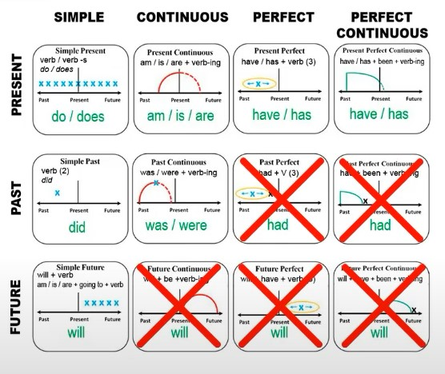
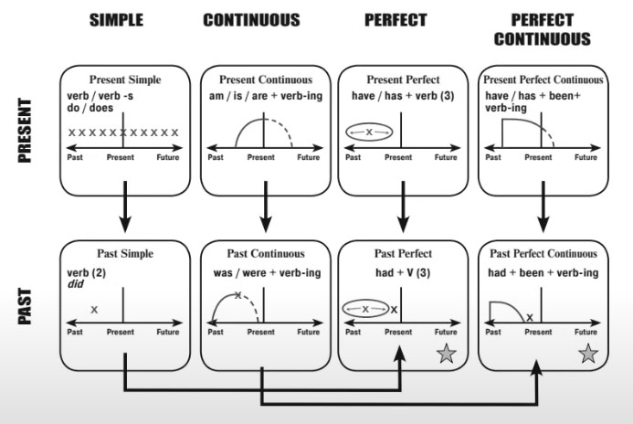
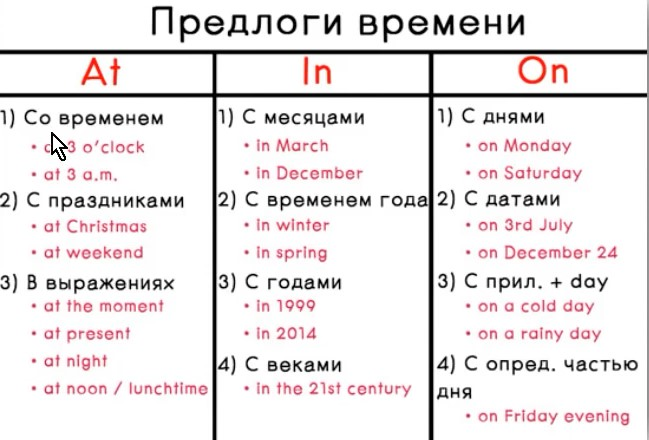

# Конспект

[YouTube](https://www.youtube.com/watch?v=xRrpvSeQq3Q&list=PL1N6sf2mpE8_FVbdTdVglEXDyDCepc4DG)

---

## Порядок слов

Тип 1.

Автор -> Действие ->  Объект

I like you. 
You study English.
He drives a car.

Тип 2.

Автор -> Является/Есть -> Каким-то/Где-то

I am a teacher. You are nice. He is happy.

---

## Be

Тра варианта: Am, is или are

Глагол состояния. После него указывают:

- Имя, название

I am Elena. It is a car.

- Кто человек по профессии

She is a teacher. You are a doctor.

- Качество или характеристика

The are educated. She is beatiful.

- Где находится человек или объект

We are in the room.

---

### Positive/Negative

I am, She is, we/you/they are

I am not, He is not (he isn't), we/you/they are not

I am not Egor. I isn't a cat. You are not an actor. She isn't strong. We are not in the pool.

Коварные связки:

- be interested (in) - интересоваться
- be afraid - бояться
- be cold - замерзнуть
- be married - пожениться
- be angry - сердиться
- be late - опаздывать
- be hungry - проголодаться
- be trusty - хотеть пить

I am interested in football;
She is afraid of spiders.
I'm cold.
They are married with childen.
You are late again.
I'm hungry. - Have a banana.

---

### Questions

Am i, Is she, are you?

Are you interested in football?
Is she afraid of spiders?
Are you cold? Are they married?

---

## Present Continuous

Now. At the moment.

Be + -ing (причастие). 

I am playing. We are playing. I'm not running. We're not jumping.
Are you reading. No, I'm listening to you. Are they watching a movie. They are watching a show.

---

## Present Simple

Автор - действие (глагол без изменений) - объект

- Предложение сообщает факт настоящего и известные истины
- Описывает реальность и положение вещей
- Говорит о событиях, которые происходят периодически

Никогда не говорит о том, что происходит прямо сейчас. 

Markers: Always, usually, sometimes, rarely, never.

В третьем лице добавляется окончание -s.

I work. You like. He works. She does. I has.

I don't like. He doesn't work.

### Questions

Do we like? 
Does he work?

---

## Preset Simple / Present Continuous

Present Simple (do, does) - рутина, привычки, научные факты

Present Continuous (am, is, are) - действие в процессе, сейчас

I am sandwiches, but I'm not eating now.
He rides a bike, but he is not riding now.

---

## Non-Continuous Verbs

Глаголы, которые никогда не используются в Continuous. Их всегда используем только в Simple:

- like, love - любить
- want - хотеть
- know - знать
- understand - понимать
- remember - помнить
- see - видеть
- hear - слышать
- prefer - предпочитать
- need - нуждаться
- belive - верить
- forget - забывать
- have - иметь

--

## Past

Времена Past показывают, что действие было связано с моментом в прошлом.

was - был, была

were - были

В вопросах автор и was/were меняются местами.

Her name was Mary. They were teachers. They were educated. We were in the room 10 minuts ago.

### Questions

Was he in a club last Friday? No, he wasn't in a club. He was asleep at home.

Were they married last year? They weren't married last year.

---

## Past Simple

Говорит о событиях, которые начались и закончились в прошлом. 

- yesterday
- last
- ago
- in 1990

К правильному глаголу добавляется окончание -ed, для неправильных - используем вторую форму (только в утверждении). 

Poisitive: 

I played. We started. He saw. It went.

Negative:

I did not = I didn't.

Question:

Did i play? Did they have? 

### Неправильные глаголы.

- find (found, found) - находить (нашел)
- buy (bought, bought) - купить (купил)
- get (got, got/gotten) - получить (получил)
- lose (lost, lost) - терять (потерял)
- sell (sold, sold) - продавать (продал)
- spend (spent, spent) - тратить (потратил)
- forget (forgot, forgotten) - забыть (забыл)

Did your brother bue a new suit last week? No, he didn't buy a new suit. He bought new shoes.

Did you childer go to school yesterday? No, my childer didn't go to school. It was Sunday yesterday. They stayed at home.

---

## Past Continuos

Процесс в прошлом.

Маркеры:

- at ... yesterday
- when + Past Simple

I was reading. They were reading.

Positive:

I was doing. We were living.

Negative:

I was not (wasn't) doing. We were not (weren't) playing.

Question:

Was he doing? Were we living?

Was he drinking water when you saw him yestarday? No, wasn't drinking beer. He was drinking coffee.

---

## Past Simple / Past Continuous

Simple - факт из прошлого, действие был закончено.

Continuous - назаконченное действие в прошлом (знаем точный момент).

1. Jack was reading a book.
2. The telephone rang.
3. He stopped reading.
4. He answered the phone.
5. He was talking on the phone at 10:15

---

## Present Perfect

Have/Has + глагол в третьем форме (V3).

Случилось и закончилось, но сейчас мы фиксируем внимание на результате.

Positive:

I have (I've) cleaned.
He has (he's) lost.

Negative:

You have not (haven't) finished.
It has not (hasn't) gone.

Question:

Have I cleaned? Has she gone?

Шаблоны предложений:

1. (I) have been to ... - (Я) бывал в этом месте.

I have been to Poland.

2. (I) have been + характеристика for/since - (Я) нахожусь в этом состоянии/месте с ... времени/в течение ... времени.

We have been here for 30 minutes.

3. How long you been + характеристика? - Сколько времени ты уже нахдишься в этом состоянии/месте?

How long have you been a teacher. - A heve been a tiacher for 15 years.

4. (I) have never + V3 - (Я) никогда (этого не делал).

I have never flown on a plane.

5. Have you ever + V3? - Ты когда-либо (делал это)?

Have you ever driven McLaren?

Маркеры (характеризуют результат):

- Just - произошло только что - I have just finished this book. It's great!
- alreary - уже произошло (раньше, чем ожидалось) - He has already invides us to the party.
- yet - еще(не), стоит в вопросах и отрицаниях в конце - Have you cooked dinner yet? - No, I haven't cooked it yet.

---

## Present Perfect Continuous

have/has + been + ing

Говорит о том, как много длится действие до настоящего момента.

1. Со словами since и for:
    - for + period - как долго длится действие
    - since + point - с какого момента
2. How long have you been + -ing.
3. Глаголы исключения: live, work, feel

Маркеры:

- for + period - He has been waiting for 2 hours. He's tired!
- since + point - He has been playing WOW since 2014.
- Question: "How long have you been + ing" - How long have they been watching us?

Глаголы исключения live, work, feel.

I have lived in this district for 3 years. == I have been living in this distict for 3 years.

Mathew has worked with us all those years. == Mathew has been working with us all those years.

I haven't felt well lately. == I haven't been feeling well lately.

Помним про Non-continuous verbs!

---

## Future

- Present Simple - говорим о том, чот произойдет по расписанию.
- Present Continuous - говорим о личных планах человека на будущее
- Future Simple - вероятно, сделаю в будущем (I will do).
- (be) going to - "собираюсь" сделать

Маркеры:

- tomorrow
- in 2050
- in the future
- in...
- next...

### Present Simple

Our bus departs in 15 minutes. The show starts at 7.

### Present Continuous

I am going to the movies with my friends tonight. Diane's son is finishing school this year. 

### Future Simple

Will + Verb

Will you join us tonight? I'm sorry but I wont't come. I'm afraid I will stay at home to help my mom.

### (be) going to - "Собираюсь сделать"

What are you to do at weekend? Oh, we have fantastic plan! We are going to go to Italy. 

Have you heard the news? Sandra is not going to marry Phil!

---

- Jenny cooks well.
- Jenny is cooking now.
- Jenny hasn't cooked dinner yet.
- Jenny has been cooking for 30 minutes.
- Jenny cooked yesterday.
- Jenny was cooking when i called her yesterday.
- Jenny will cook tomorrow.

---

## Модальные глаголы

Это смесь вспомогательных и смысловых глаголов:

- Как вспомогательный глагол, передают время и меняются местами с автором действия в вопросе
- Как смысловой глагол, имеют перевод.

Will, shall, can, could, might (may), must, should, would.

1. Каждый модальный глагол имеет одну форму, которая неизменна.
2. Заменяют вспомогательные глаголы.
3. Передают время в приложении.
4. Значения модальных глаголов пересекаются.
5. После модального глагола идет инфинитив.

**Shall** - следует это сделать (обычно в вопросах). 

Shall I? Shall we? - ждем одобрения собеседника. Настоящее время.

**Will** - призыв к действию (обычно в вопросах).

Will + not = won't - вопреки ожиданиям, действие не происходит. Настоящее, будущее время.

Will you help me with the dishes? Something's wrong with my car, it won't start.

**Can** - могу, умею, имею возможность. Настоящее, будущее время

Can + not = can't = cannot

I can stay till 7. Can i borrow your pen. He can't ride a bike.

**Could** - мог, умел (в прошлом), мог бы. 

Передает вежливость и уважительный тон, особенно в вопросе - could not = couldn't.

He could draw very well when he was little. Could you hold by bag, please? I couldn't ride a bike when I was little.

**Might** - возможно, вероятно. 

Might not = might't. Настоящее, будущее время.

I might see Karen tomorrow. 
What might happen at the meeting. 
You might not understand my decision.

**Must** - должен, обязан. 

Must not = must't - нельзя, запрещено. Настоящее, будущее время.

You must obey the rules!
Why must I listen to your complains?
You mustn't touch my personal belongings.

**Should** - следует (так сделать). Помогает дать совет или рекомендацию.

Should not = should'y - лучше так не делать, не стоит так поступать. Время: настоящее.

You should tell him what happened. Should I trust him? I think he should'n smoke.

**Would** - (сделал) бы. Говорит о нереальных ситуациях.

Would not = wouldn't. Настоящее (нереальное) время.

Would you like ... ? Вы бы не хотели? Ты бы не хотел?

If i were you, I would ... - Если бы я был на вашем месте, я бы ... 

You would make a good athlete. 
Would you like to go out? 
If I were you, I would't even talk to him.

### Модальные конструкции

1. Дублируют модальные глаголы. 
2. Передают такое же, либо очень близкое значение.
3. Меняются по временам (по стандартным правилам)

- Have to == must
- Used to == would
- Be able == can

**Be able to** - имею возможность, могу, сумел, смог, смогу, сумею.

Используется в прошлом, настоящем, и будущем времени. To be меняется по временам.

I was able to travel last year.
I'm ton able to travel a lot.
Will you be able to travel last mount.

**Have to** - должен, обязан, вынужден.

Have to можно использовать в прошедшем, настоящем и будущем, в отличии от must.
Have, как глагол, меняется по стандартным правилам.

He doesn't have to work on Sundays.
Did he have to wait for you yesterday? 
I had to listen to you, but i didn't.

**Used to** - (делал это) раньше.
Используется только в пршлом, показывает регулярное действие.
Также подразумевается, что больше вы так не делаете.

I used to watch TV show every week.
Did you use to ride bikes with your dad?
I didn't use to get up late, but now I like to sleep in.

---

## Imperative

Повелительное наклонение. Показывает просьбу, приказ, призыв к действию.

- Высказываем просьбу
- Отдаем приказ
- Выразить призыв к действию

Для вежливости говорите: "Please". "Не" передаем с помощью dont't.

- Сделай - Do it.
- Пожалуйста, сделай это -  Please, do it.
- Не делай это - Don't do it.
- Давай сделаем - Let's do it!
- Давай не делать этого - Let's not do it.

**Это почти единственный случай, когда предложение не содержит автора действия**

---

## There is / There are

Используется, когда что-то существует, находится, расположено, имеется. В дополнении часто указана локация (где это есть), но не всегда.

It используют, говоря о времени, погоде, дистанции (в русском языке такие предложения называются безличными).

- There - там. There is a problem.
- It - это. It is a probplem.

There is a man at the door. It there love in his heart? There are no garantees (aren't eny).

It's 7 o'clock. It's so cold outside. It's 1 km from my place to the nearest supermarket.

---

## 5 types of questions

1. Общий

2. Разделительный

3. Специальный

4. Вопрос к подлежащему

5. Вопрос с "Или".

Вопросительное слово + вспомогательный глагол + автор + смысловой глагол + дополнение/обстоятельство и т.п.

Did the students white the test? 
Where did the students write the test? 
Who wrote the test? 
Did the students write the test or read the book?
The students wrote the test, didn't they? - вопрос "переспрос"

---

## Reported Speech (Косвенная речь)

I am sad = She said (that) / she was sad. 

- Am, is => was - She said that she was feeling sick.
- Are => were - They said were busy.
- Have => had - Mike said that he had no money.
- Will => would - They said they would help us later.
- Was, were => has been - She said that she has been feeling ill yesterday.
- Don't, doesn't => didn't - I said, I didn't like alcohol.
- didn't => hadn't + 3 форма глагола (pas perfect) - She said she hadn't had time to see me yesterday.
- Go, goes => went (1 форма глагола => 2 форма глагола) - She said she ate healthy food.
- Went => had gone (2 форма глагола => Past perfect) - She said she had gone to Paris last year.

---

## Герундий и инфинитив

Автор => Герундий/Инфинитив

Герундий - глагол с -ing (не связан с временами)

Инфинитив - глагол в начальной форме, часто встречается связка с to-infinitive.

### To - инфинитив

Если глагол один из списка, то дополнительное действие указываем через **to**:

- want
- plan
- decide
- try
- hope
- expect
- offer
- forget
- need
- promise
- refuse
- learn

I want to help you. They hope to finish the fork in time. We decided ti sell pur car. I try to be a good student. She is learning to drive.

### Ask / tell / expect / persuade / teach + объект + to-инфинитив

Asked her to help me. I told him to leave. Mum advides Kathy not to et married so soon. Dad taught how to drive a car.

### Make / let + объект + ~~to~~-инфинитив

He made me work all day! Please, don't make me do this. Let me help you. He was innocient, so the police let him go.

### To-инфинитив = причина/цель действий

He is a friend, he came here to here. 
I started early to finish work in time. 
She shouted to make him stop! 
I went out to buy a bottle of water.

### Герундий (ing-verb)

**Объект + enjoy/stop/mind/finish + -ing**

Rebeccf enjoys reading. D
Do you mind holding the door for me.
I'd suggest watching sometimes else.
Please, stop fighting.

**Объект + предлог + -ing**

He is strong in solving math sums.
I'm thinking of buying a new car.
I forgot about calling Dona.
She is interested in travelling.

---

## Местоимения, артикли - то, что перед существительным

**Существительное в единственном числе**

- а (an)
- the
- местоимение
- количество, выраженное словом 'one'

**Существительное во множественном числе**

- Без артикля
- Артикль the
- Местоимение
- Количество, выраженное числом или словами *some*, *any*, *a lot of* и т.д.

**Неисчисляемое существительное**

- Без артикля
- Артикль the
- Местоимение
- Количество, выраженное меркой или словами *some*, *any*, *a lot of* и т.д.

- I => my
- we => our
- you => your
- he => his
- she => her
- they => their
- she => her
- they => their
- this == these
- that == those

### Неопределенные местоимения

- Some и any часто передают значение "какое-то количество"
- Some может стоять в утверждении и вопросе
- Any может стоять в отрицании и вопросе
- В общих вопроса (yes/no questions) мы используем any.
- В вопросах типа *Would you like ... ?* обычно стоит *some*.
- Часто *some/any* используются в предложениях с *there*.

There are some people at the door.
Would you lile some coffee?
Are there any people at the door?
There isn't any money in my purse. == There is no money in my purse.
There aren't any people at the door == There are no people at the door.

**Количество уточняют**:

- all - все
- some, any - какой-то
- enought - достаточно
- a lot of, lots of - много
- most - большинство
- no, none of - никакого (количества)
- plenty of - множество
- both - оба
- eighter - либо тот, либо этот
- neither - никакой из двоих
- each - каждый
- (a) few - несколько (только для исчисляемых)
- (a) little - немного (только для неисчисляемых)
- much - много
- a bit of - чуть-чуть

All players it the tean are good. She is a doctor. Most of her friends are doctors, too. There isn't enought food for everyone. There is plenty of milk in the fridge. Both her brothers are sportsmen. How much time do you need? There are few bottles of water left. There is little water left.

---

## Артикли

- A - всегда связан с одном предметом, мы не имеем конкретной информации о нем
- The - уточняет, о ком конкретно. Может использоваться для нескольких объектов

I saw a woman. When she came closer, I saw that the woman was familiar.

## This, that, these, those

Сворачиваются до *the*

- This bike is good = The bike is good
- Those men are waiting = The men are waiting

**В теме *Артикли* очень много исключений**

## Наречия - Adverbs (Как? Каким образом?)

**Маркер времени**:

- always
- often
- usually
- sometimes
- rarely
- never

Ставим перед действием (обычно)

They don't always understand each other. My friends often travel. We usually eat homemade food. Do you sometimes feel lonely. I rarely talk on the phone. Has never been to the USA.

**Образ действия**:
- Наречия на -ly

Исключения: *well*, *fast*, *late*, *early*, *hard*

Стоит после глагола

Cheetans run very quickly. I want to speak English fluently. If you do it, do it well. He always comes home late after work. Life has become hard for her.

**Усиления**
- very
- so
- too
- quite, rather
- pretty
- really

Стоят перед прилагательным или другим наречием

She feels so depressed sometimes. He is very active in the morning. You drive too quickly, it's dangerous! Mike is quite a good sportsman. I think is's pretty fair. English is really importnant nowadays.

## Прилагательное в предложении

Стоит перед существительным или после *linking verbs*(be, get, become, look, feel, smell).

I am so happy today. Our life is getting better. She became obsessed with this actor! Go home, you look so tired. I feel hungry. Oh, the smell is awful!

## Порядок слов в предложении (прололжение)

Предмет => Действие + наречие(как) / предлог + существительное (где) / предлог + существительное (когда)

I work with him in the office (где). I see him every day (когда). I meet him accidentally (как) on my way to work (где) from time to time (когда)

---

## Условные предложения - Conditionals

Future/Present => if/when => Present

0 conditional real | If I am at home, I always watch TV
1 conditional real | If I am at home, I will watch TV.

Would => if => Past

2 conditional real | If I were at home, I would watch TV.

I travel when I have an opportiuity. 
I will travel to Paris when I have an opportunity.
I would travel to Paris if I had an opportunity.
I don't go uou if I can stay at home.
I won't tell anyone if you want.
She wouldn't help even if she could.

## Поясняющие предложения - Relative clause

Relative clause => Relative Clause

Одно родственное предложение разрывает другое. Запятых нет.

Чаще всего начинаются с трех слов: *who*, *which*, *that*

The man *who called me* was my friend.
He met a girl *who eventually became his wife*.

Если поясняющие предложения имеют полную структуру, то слова: *who*, *which*, *that* мы выбрасываем.

He doesn't like the food *she cooks*.
The dress *she was wearing* was new.
It the dentist *you visit* good?

## Предлоги

Объединяют группы слов по смысл. Стоят перед существительными (кроме исключений и фразовых глаголов)

- at - указывает на что-то точное (в точном месте, в точное время)
- on - указывает на поверхность указывает на поверхность или на конкретный день
- in - "внутри" большого периода времен или локации

I'll meet you at 9 o'clock.
He lives at 120 Hill St.
Do you want to go to the movies on Friday?
Sherlock Holmes lived on Baker Street.
When is Charlie's birtday? -In June, I guess.
Toronto is in Canada.

- in - внутри
- on - на поверхности
- under - под
- behind - сзади
- in front of - перед
- above - над
- below - ниже уровня
- between - между
- next to - после