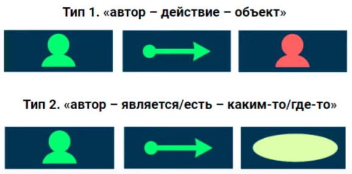

# Present Simple (Настоящее простое)

They have a lot of books. They read a lot.

Мы описываем этих людей, у них много книг, они читают. Не прямо сейчас, а вообще, в целом. Мы используем эту форму, когда описываем то, что естественно, типично, регулярно, обычно.

He's eating am ice cream. (Прямо сейчас)

He *likes* ice cream. (Вообще, в целом)

I/we/you/they + read/like/live...

He/she/it + reads/likes/lives...

---

## Questions

Do/Does + subject + infinitive

[Урок](https://youtu.be/J51sBGhLnA4)
[Задания](https://youtu.be/LK4AsgyWG0g)

Do you play the guitar?

Does she play the guitar?

Do you friends live near here?

Where do your parents live?

---

## Negative

[Урок](https://youtu.be/Cf4USN6VbFI)

*DO/DOES + NOT + Infinitive*

I do not(don't) drink coffee

She does not(doesn't) drink coffee
