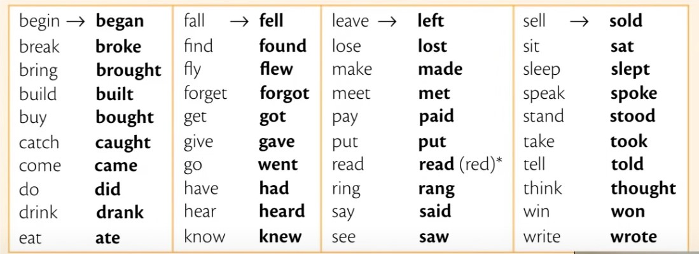

# Past Simple

[Урок](https://youtu.be/QWfpyCu4UVg) [Примеры](https://youtu.be/V2O5NOi_4l8) [Задания](https://ok-tests.ru/unit-11-red/)

**I did**

Говорит о событиях, которые начались и закончились в прошлом.

Маркеры:

- yesterday
- last
- ago
- in 1990

Все глаголы делятся на правильные и неправильные. \
Чтобы поставить *правильный* глагол в Past Simple, нужно добавить окончание **-ed**.

work  => worked  (работать => работал) \
clean => cleaned (чистить  => почистил) \
start => started (начинать => начал)

I *clean* my teeth every morning. This morning I *cleaned* my teeth; \
Terry *worked* in a bank from 2005 to 2011. \
Yesterday it rained all morning.

При **y** перед согласным в конце, меняем на **ied** \
Иногда происходит удвоение, такие слова лучше просто запомнить.

try   => tried \
stop  => stopped \
study => studied \
plan  => planned \
copy  => copied \
...

*Неправильный* поставить во вторую форму:

---

Вопросы и утверждения: [Урок](https://youtu.be/YNnysI6VGqo) [Примеры](https://youtu.be/cgxdbum2drg) [Задания](http://ok-tests.ru/unit-12-red/)

## Questions

*Did* your sister phone you? \
What *did* you *do* yesterday evening? \
How *did* the accident *happen*? \
Where *did* your parents *go* for their holiday?

Did you see? \
Did it have?

**Short answers:**

Yes, *I* **did**. \
No, we **didn't**.

---

## Negative

Вопрос о действиях, а не о состоянии

I **did not (didn't)** + infinitive ...

I didn't have \
He didn't go
